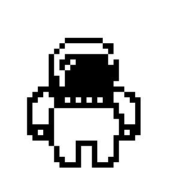
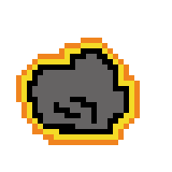

# Space

The astronaut is in the space to collect aliens but the asteroids are flying through. 

To play `Space` game online visit at: [Space Online Game](https://hninmabalo.github.io/space-project-1-GA-SEI-/)

<hr />

## How to play

The game can simply play online on the website. The player is able to control with the `arrow keys` to move the astronaut around on the page. The asronaut has to collect the aliens to gain points while avoiding the asteroids not to lose lives. The game will be over when the player has `0` health points.

<hr />

## Technologies

* HTML 
* CSS
* JavaScript 

## Art Drawing application 

All of the character images in the game drawn by the game creater by using [Piskelapp](https://www.piskelapp.com/). One of the process of drawing down below:


<hr />

## Initial Wireframes 

This is how it started at the beginning. 


Logic for the functions of the game.


## Game Screen:


<hr />

## How it works 

### HTML

Creating `canvas` for the game and `layout` by using grid method.

```html
<div id="container">
     <aside id="top-left"><h2>Score: <span id="score">0</span></h2></aside>
     <button id="start"><aside id="top-right"><h2>Start Game</h2></aside></button>
     <main>
        <canvas id="game" width="400" height="350">
             
            
            
        </canvas>
     </main>
     <aside id="btm-left"><h2>Health: <span id="health">3</span></h2></aside>
     <aside id="btm-right"><h2>Game Instruction:<br><br>- collect the aliens<br>- avoid the asteroids<br> <br>- use arrow keys<br> to control <br>the astronaut</h2></aside>
     <aside id="center-left"><h2 id="movement"></h2></aside>
    </div>
```

### CSS

Grid for `container` 

```css
#container {
    max-width: 70em;
    background-image: url("../img/sp.jpg");
    margin: 0 auto;
    padding: 1em;
    display: grid;
    grid-gap: 1em;
    grid-template-rows: .25fr .5fr .25fr;
    grid-template-columns: .25fr .5r .25fr;
    grid-template-areas: "top-left game top-right"
                         "center-left game btm-right"
                         "btm-left game btm-right";
}
```

Game `canvas` styles in css

```css
canvas {
    background-image: url("../img/sp.jpg");
    background-repeat: repeat;
    width: 100%;
    height: 100%;
}
```

### JavaScript

Player and opponents classes

```javascript
class Player {
    constructor(x, y, image, width, height) {
        this.x = x;
        this.y = y;
        this.image = image;
        this.width = width;
        this.height = height;
        this.alive = true;
        

        this.render = function() {
            ctx.drawImage(this.image, this.x, this.y, this.width, this.height);
        }
    }
};


class Opponents {
    constructor(image, width, height) {
        this.image = image;
        this.width = width;
        this.height = height;
        this.x = game.width;
        this.y = Math.random() * game.height;
        this.speed = Math.random();
        this.distancesX = Math.random() * 5 + 3;
        this.distancesY = Math.random() * 5 - 2.5;
        this.alive = true;
    }
    update() {
        this.x -= this.distancesX;
        this.x += this.speed;
        this.y += this.speed;   
    }
    draw() {
        ctx.drawImage(this.image, this.x, this.y, this.width, this.height);
    }
};
```

Spawning function for the opponets to appear out form the screen 

```javascript
function spawnOpponents() {
    setInterval(() => {
        arrayAlien.push(new Opponents(alienimg, 60, 70))
    }, 750); 
    setInterval(() => {
        arrayAsteroid.push(new Opponents(asteroidimg, 50, 50))
    }, 1750);
};
```

Game is over when the player health is `0` and reseting the game function 

```javascript
function gameLose() {
    if (playerHealth < 1) {
        console.log("Game Over");
        game.remove();
        astronaut.alive = false;

    gameOver.textContent = `GAME OVER! Your Best Score is ${gameScore}! Click here to play again!`;
    gameOver.style.fontSize = "x-large";
    gameOver.style.cursor = "pointer";

    gameOver.addEventListener("click", function() {
        location.reload();
    })
    }
};
```
<hr />

## Credit

Space background image is downloaded from [Imgur: The magic of the internet ](https://imgur.com/YWuotPe.jpg)
